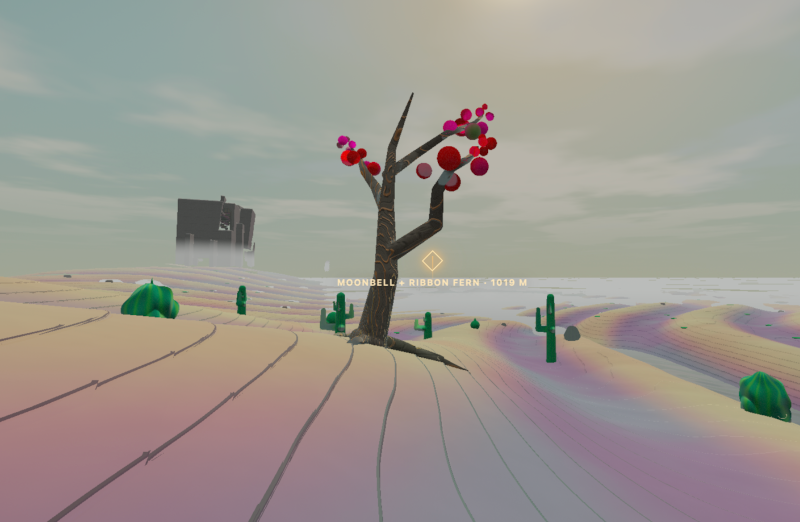
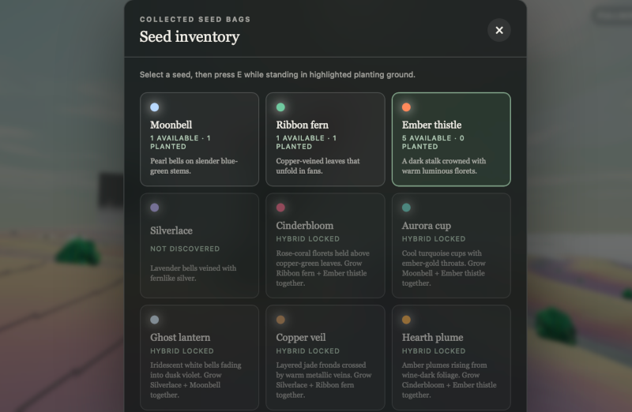
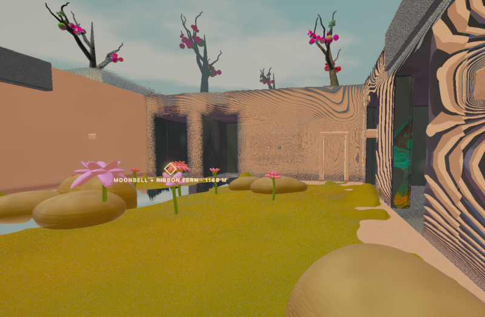

# Mind Landscapes

A persistent generative landscape shaped by images and text.







## Challenge

Read about the [challenge here](INFERENCE_EFFICIENCY.md)

## Minimum Hardware Requirements

These are practical starting points for a 1920 × 1080 desktop display without
WebXR. Performance also depends on browser version, display pixel density, world
complexity, and thermal limits. Auto mode is recommended when performance varies.

All platforms require a current hardware-accelerated browser with WebGL 2 enabled,
up-to-date graphics drivers, and at least 2 GB of free storage.

| Platform | Quality | Processor | Memory | Graphics |
| --- | --- | --- | ---: | --- |
| Windows 10/11, 64-bit | Low | 4-core Intel Core i5 or AMD Ryzen 3 | 8 GB | Intel Iris Xe, Radeon Vega 8, GeForce GTX 1050 Ti, or Radeon RX 570 |
| Windows 10/11, 64-bit | Medium | 6-core Intel Core i5 or AMD Ryzen 5 | 16 GB | GeForce GTX 1660 Super, Radeon RX 5600 XT, or Intel Arc A380 |
| Windows 10/11, 64-bit | High | 6-core Intel Core i5 or AMD Ryzen 5 | 16 GB | GeForce RTX 3060 or Radeon RX 6700 XT |
| 64-bit Linux with current Mesa or proprietary drivers | Low | 4-core Intel Core i5 or AMD Ryzen 3 | 8 GB | Intel Iris Xe, Radeon Vega 8, GeForce GTX 1050 Ti, or Radeon RX 570 |
| 64-bit Linux with current Mesa or proprietary drivers | Medium | 6-core Intel Core i5 or AMD Ryzen 5 | 16 GB | GeForce GTX 1660 Super, Radeon RX 5600 XT, or Intel Arc A380 |
| 64-bit Linux with current Mesa or proprietary drivers | High | 6-core Intel Core i5 or AMD Ryzen 5 | 16 GB | GeForce RTX 3060 or Radeon RX 6700 XT |
| macOS 13 or later | Low | Apple M1 or newer | 8 GB unified memory | Apple M1 7-core GPU or better |
| macOS 13 or later | Medium | Apple M1 Pro, M2, or newer | 16 GB unified memory | 10-core Apple GPU or better |
| macOS 13 or later | High | Apple M2 Pro, M3 Pro, or newer | 16 GB unified memory | 16-core Apple GPU or better |

High-DPI displays may render substantially more pixels than 1080p. Use Auto,
Low, or Medium mode if the browser cannot sustain a comfortable frame rate.
WebXR headsets have higher resolution and frame-rate requirements and may need
faster hardware than the High desktop baseline.

## Run

Requires Node.js 18 or newer.

OpenAI-assisted analysis is optional. To enable it, copy `.env.example` to `.env` and add an OpenAI API key:

```env
OPENAI_API_KEY=your_api_key_here
OPENAI_MODEL=gpt-5-nano
PORT=8000
```

Start the local server:

```sh
npm start
```

Open [http://localhost:8000](http://localhost:8000).

## Explore

- Drag the mouse over the landscape to look around.
- Move with WASD or the arrow keys.
- Hold Shift to move faster.
- Drag and drop images, Markdown files, text files, or selected text to reshape the world.
- Use **Choose files** as an alternative to drag and drop.
- Open **World**, or press C, to review influences, adjust rendering quality and the day/night cycle, edit generated settings, remove memories, or export the world document.
- Open **Seeds** to review collected seed bags, choose a plant species, and see cultivation statistics.
- Compatible browsers and headsets can enter through WebXR when available.

## Cultivation

Generated buildings contain collectible seed bags for Moonbells, Ribbon ferns, and Ember thistles. Bags inherit the identifying color of their species and occupy different rooms across both underground floors. Leaving and re-entering a building advances its saved visit generation, replacing the previous visit’s bags with a fresh stable arrangement instead of moving them while the player explores. Carry them outside and follow the planting beacons to protected, sun-accessible ground. A nearby planting pocket illuminates on the landscape; press E to plant the selected seed. When one seed type runs out, the inventory automatically advances to the next available type.

Each plot supports two different plants. Growing a specific pair to maturity on the same plot reveals its hybrid seed bags inside buildings; separate plots or partially grown parents do not unlock them. Ten hybrids—Silverlace, Cinderbloom, Aurora cup, Ghost lantern, Copper veil, Hearth plume, Prism reed, Velvet star, Glass fern, and Eclipse rose—form a branching progression from the three base species. Locked recipes remain visible in the seed inventory so the next pairing is discoverable.

Plants grow gradually from a small root or stem as daylight passes, persist between sessions, and remain marked by warm navigation beacons after planting. Mature plants resolve into close detail—scalloped bell blooms, paired fern leaflets, or individual thistle florets—with species-specific stature, spread, crown scale, and coordinated palettes. Darker stems, analogous foliage gradients, complementary blooms, and fine veins or filaments make nearby parts readable, while distant specimens use simplified silhouettes or disappear.

## How influences work

Images are analyzed for properties such as color, brightness, contrast, visual complexity, warmth, and dominant palette.

Writing is analyzed for word themes, structure, density, rhythm, and mood. OpenAI-assisted analysis can provide a more nuanced interpretation when configured.

These characteristics influence the terrain, vegetation, water, atmosphere, lighting, architecture, interiors, color palette, and other generative systems. Removing an influence recalculates the landscape.

The generated world settings can be reviewed and edited from the **World** panel. Explicit values placed in `overrides` remain preserved when influences change.

## Persistence

The landscape and its influences are stored locally in IndexedDB, allowing the world to be restored across sessions in the same browser and site origin. The maze is saved as a compact versioned recipe (seed, media fingerprint and generation parameters), rather than a large geometry or portal table. Given that recipe and a building address, its rooms and portal links reconstruct deterministically. Exported worlds include the recipe.

Building stairs lead into branching 7 × 7 Backrooms-style networks with broad hallways, blind corners, loops, uneven rooms and two portal locations per floor. A second flight selected from a traversable first-floor corridor descends into an independently generated lower 7 × 7 network. Every room on both floors connects back to its stairs. Portals have directed, source-specific destinations, so they can jump past nearby buildings and need not form reciprocal pairs. Arrival positions preserve the source floor, face into a clear corridor, and sit outside portal activation zones.

Media content changes the layout seed; interpreted psychedelic, mechanical, ritual, ornate, sandy and abandoned qualities also bias turns, loops, room sizes and portal reach. Adding, replacing or removing media regenerates the recipe. Reloading, changing rendering quality or adjusting the day cycle retains it. There is no per-frame randomness or database write. Clearing site storage removes the saved world; export it to retain a portable copy.

Export the world document from the **World** panel to keep a portable JSON copy of its generated settings and memories.

## Rendering

The **World** panel provides Auto, Low, Medium, and High rendering profiles, along with a reduced-motion option.

Auto mode dynamically adjusts rendering resolution, vegetation density, and procedural detail according to current performance. Nearby vegetation, buildings, terrain, and water receive additional detail, while distant trees retain stable trunks and compact crowns. Distant buildings begin as weathered boulder-like monoliths and continuously resolve into entrances, pylons, cantilevers, and interiors as the explorer approaches; the transition finishes outside the structure footprint so visible walls, doorways, and stairs remain aligned with collision.

As buildings resolve, sparse moss and climbing vines emerge on exterior wall faces along the stable daylight path. A single compact grayscale mask drives both layers, with reduced fine-vine detail on Low quality and no added geometry or draw calls.

Low renders 78% of the stable tree set and 55% of minor plants, Medium renders 92% and 80%, and High renders the full population. Branch generations grow outward continuously as the viewer approaches. Each profile also scales the distance at which roots, branches, leaflets, and surface detail are evaluated.

Nearby two-floor maze connectivity is streamed as a 77 × 154 byte RGBA texture (about 47 KB), rebuilt only when the camera crosses a structure cell or world settings change. CPU collision checks share the generated graphs and use bounded caches. Geometry settings and maze connectivity update together, while colors and atmospheric settings can still interpolate.

When no API key is configured, media processing falls back to the deterministic local analyzer.

### Surface materials

Procedural and PNG-backed surface and bump algorithms live in `src/render/materials/`. Start
with its `catalog.js` to find every registered material, its mapping strategy,
outputs, texture inputs, artist controls, and shader implementation. The folder
README describes the module contract for adding procedural or PNG-backed
variants without expanding the main lighting shader.

### Personal art

Open **World → Personal art** and choose a folder, ZIP archive, or individual
PNG/JPEG images. Imports replace the current art pack (up to 32 images, 16 MB per
image and 128 MB total). Nested folders are supported; ZIPs must use standard
stored or deflate compression, without encryption. Images are fitted into 256 px
transparent atlas tiles while preserving aspect ratio and PNG alpha.

The art is painted onto interior walls, with denser placement in underground
hallways. Large murals occur intermittently in spacious, offset wall bays, with
clear stretches between pieces and occasional quarter turns. The world seed determines placements, scale, rotation, warp,
saturation and weathering; existing color and interior settings influence the
paint treatment. Placement stays fixed while walking and across quality levels.
Use **Wall coverage**, **Show personal art**, or **Remove art** to manage it.

Art is saved separately in IndexedDB on this browser/origin. It is never sent to
AI analysis, included in exported world JSON, or bundled into the open source
build. Clearing browser site data removes it; import the original pack again on
another browser or device. If browser storage fails, the UI reports that the art
is available only for the current visit.
