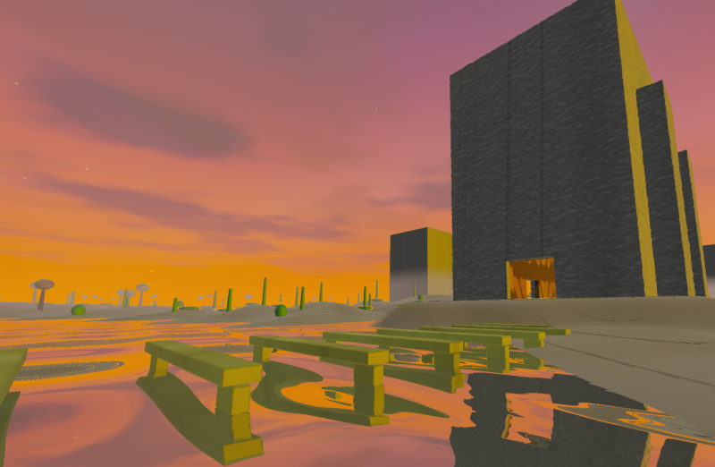

# Mind Landscapes

A persistent generative landscape shaped by images and text.



## Run

Requires Node.js 18 or newer.

OpenAI-assisted analysis is optional. To enable it, copy `.env.example` to `.env` and add an OpenAI API key:

```env
OPENAI_API_KEY=your_api_key_here
OPENAI_MODEL=gpt-5-nano
PORT=8000
```

Start the local server:

```sh
npm start
```

Open [http://localhost:8000](http://localhost:8000).

## Explore

- Drag the mouse over the landscape to look around.
- Move with WASD or the arrow keys.
- Hold Shift to move faster.
- Drag and drop images, Markdown files, text files, or selected text to reshape the world.
- Use **Choose files** as an alternative to drag and drop.
- Open **World**, or press C, to review influences, adjust rendering quality and the day/night cycle, edit generated settings, remove memories, or export the world document.
- Compatible browsers and headsets can enter through WebXR when available.

## How influences work

Images are analyzed for properties such as color, brightness, contrast, visual complexity, warmth, and dominant palette.

Writing is analyzed for word themes, structure, density, rhythm, and mood. OpenAI-assisted analysis can provide a more nuanced interpretation when configured.

These characteristics influence the terrain, vegetation, water, atmosphere, lighting, architecture, interiors, color palette, and other generative systems. Removing an influence recalculates the landscape.

The generated world settings can be reviewed and edited from the **World** panel. Explicit values placed in `overrides` remain preserved when influences change.

## Persistence

The landscape and its influences are stored locally in the browser, allowing the world to be restored across sessions.

Export the world document from the **World** panel to keep a portable JSON copy of its generated settings and memories.

## Rendering

The **World** panel provides Auto, Low, Medium, and High rendering profiles, along with a reduced-motion option.

Auto mode dynamically adjusts rendering resolution according to current performance. Nearby vegetation, buildings, terrain, and water receive additional procedural detail, while distant forms use simplified representations.

Vegetation remains fully detailed within approximately 35 meters and morphs into simplified geometry by approximately 42 meters.

When no API key is configured, media processing falls back to the deterministic local analyzer.
